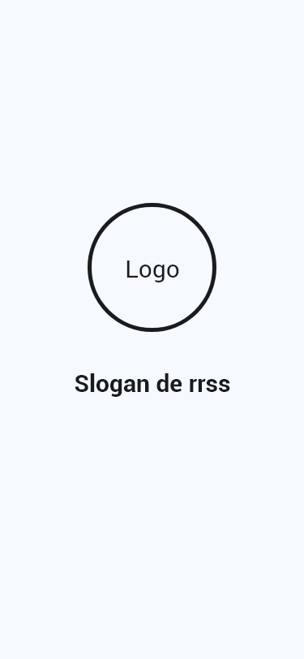
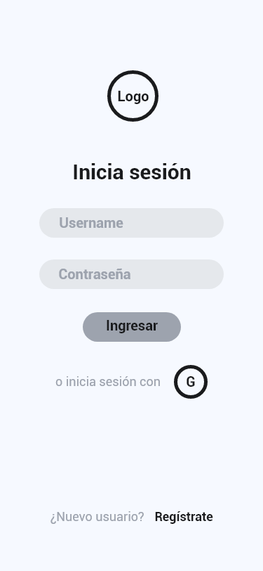
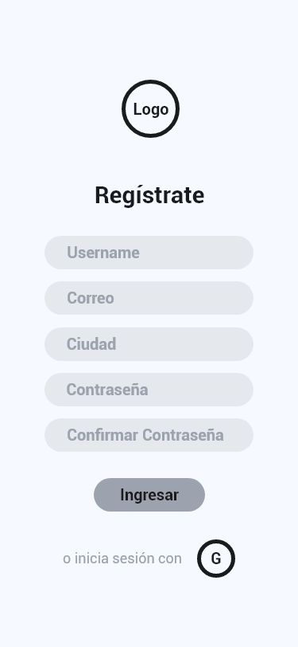
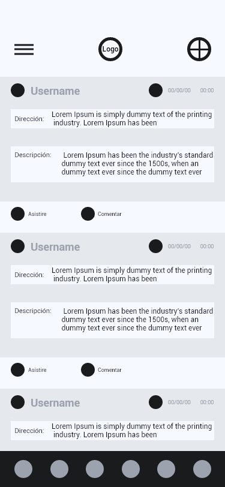
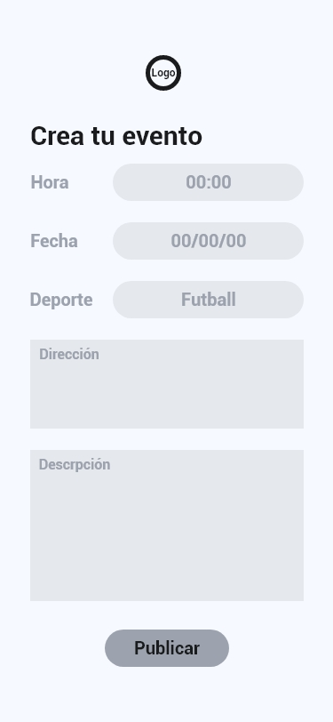
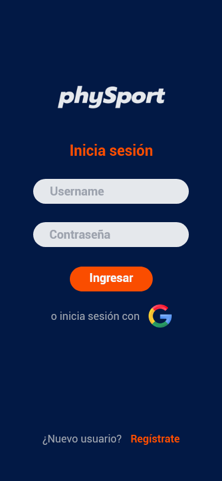
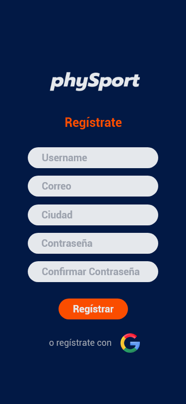
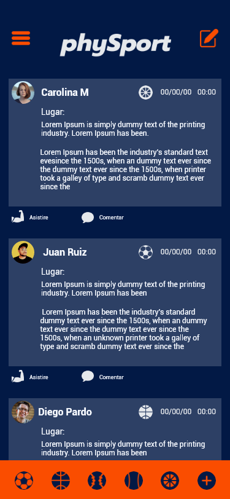
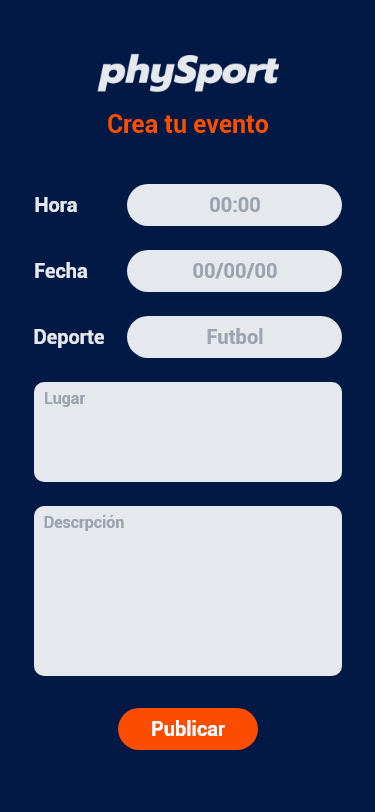

# Red Social phySport 💙🧡💙🧡

## Índice 💨

* [1. Resumen del proyecto](#1-resumen-del-proyecto)
* [2. Objetivo de la página](#2-objetivo-de-la-página)
* [3. Historias de usuario](#3-historias-de-usuario)
* [4. Prototipo de baja fidelidad](#4-prototipo-de-baja-fidelidad)
* [5. Prototipo de alta fidelidad](#5-prototipo-de-alta-fidelidad)
* [6. Feedback](#6-feedback)
* [7. Objetivos de aprendizaje](#7-objetivos-de-aprendizaje)

## 1. Resumen del proyecto 💪

**phySport** es un proyecto para amantes del deporte, podrás encontrar eventos de tu interes, conocer otros deportistas, interactuar con otros usuarios y más. En la red social **phySport** podrás registrate para crear eventos, editarlos, borrarlos y asistir. **"Find a game, win friends"**.

## 2. Objetivo de la página 🚴‍♀️🤾‍♂️

Es una red social enfocada en personas amantes del deporte o deportistas que quieran interactuar con personas que tengan intereses comunes en algún deporte. Podrás crear eventos en los que pueden participar personas que esten interesadas o se encuentren cerca a tu ubicación, Es una red social fácil de usar, intuitiva y entendible para el usuario.

## 3. Historias de usuario ⚡

* H1 - Yo como usuario, quiero poder registrarme con mi correo,
para poder publicar eventos y mirar los eventos cerca de mi ciudad.
* H2 - Yo como usuario quiero poder iniciar sesión con mi correo,
para crear un usuario e interactuar.
* H3 - Yo como usuario, quiero poder crear un evento deportivo,
para completar mi equipo de futbol.
* H4 - Yo como aficionado del deporte, quiero poder visualizar los eventos cercanos a mi ubicación, para poder hacer deporte.
* H5 - Yo como usuario de la aplicacion, quiero saber cuantas personas asistiran al evento y tener la opcion de asistir, para poder participar.
* H6 - Yo como usuario de la aplicacion PhySport, quiero poder editar el evento que cree, para que las personas interesadas tengan la informacion actualizada.
* H7 - Yo como usuario, quiero poder eliminar el evento que cree, porque ya no se realizará.

## 4. Prototipo de baja fidelidad 👇

      

## 5. Prototipo de alta fidelidad 👌

El prototipo de alta fidelidad se realizo en Adobe XD

     

## 6. Feedback 👩🧑

Entre las mejoras recibidas en el feedback se pedia ajustar el tamaño de los botones en los formularios, colocar ejemplos en los placeholder de los inputs del formulario "evento" asignados a lugar y descripción, ajustar contenido del timeline para cada evento publicado, estandarizar bordes de los inputs y agregar labels.

## 7. Objetivos de aprendizaje 🚩

### HTML y CSS

* [x] [Uso de HTML semántico.](https://developer.mozilla.org/en-US/docs/Glossary/Semantics#Semantics_in_HTML)
* [x] Uso de selectores de CSS.
* [x] Construir tu aplicación respetando el diseño realizado (maquetación).
* [x] [Uso de flexbox en CSS.](https://css-tricks.com/snippets/css/a-guide-to-flexbox/)

### DOM y Web APIs

* [x] Uso de selectores del DOM.
* [x] Manejo de eventos del DOM.
* [x] [Manipulación dinámica del DOM.](https://developer.mozilla.org/es/docs/Referencia_DOM_de_Gecko/Introducci%C3%B3n)
(appendChild |createElement | createTextNode| innerHTML | textContent | etc.)
* [x] [History API.](https://developer.mozilla.org/es/docs/DOM/Manipulando_el_historial_del_navegador)
* [x] [localStorage.](https://developer.mozilla.org/es/docs/Web/API/Window/localStorage)

### JavaScript

* [x] Uso de condicionales (if-else | switch | operador ternario)
* [x] Uso de funciones (parámetros | argumentos | valor de retorno)
* [x] Manipular arrays (filter | map | sort | reduce)
* [x] Manipular objects (key | value)
* [x] Uso ES modules ([`import`](https://developer.mozilla.org/en-US/docs/Web/JavaScript/Reference/Statements/import)
| [`export`](https://developer.mozilla.org/en-US/docs/Web/JavaScript/Reference/Statements/export))
* [x] Diferenciar entre expression y statements.
* [x] Diferenciar entre tipos de datos atómicos y estructurados.
* [ ] [Uso de callbacks.](https://developer.mozilla.org/es/docs/Glossary/Callback_function)
* [x] [Consumo de Promesas.](https://scotch.io/tutorials/javascript-promises-for-dummies#toc-consuming-promises)

### Testing

* [x] [Testeo unitario.](https://jestjs.io/docs/es-ES/getting-started)
* [ ] [Testeo asíncrono.](https://jestjs.io/docs/es-ES/asynchronous)
* [ ] [Uso de librerias de Mock.](https://jestjs.io/docs/es-ES/manual-mocks)

### Estructura del código y guía de estilo

* [x] Organizar y dividir el código en módulos (Modularización)
* [x] Uso de identificadores descriptivos (Nomenclatura | Semántica)
* [x] Uso de linter (ESLINT)

### Git y Github

* [x] Uso de comandos de git (add | commit | pull | status | push)
* [x] Manejo de repositorios de GitHub (clone | fork | gh-pages)
* [x] Colaboración en Github (branches | pull requests | |tags)
* [ ] Organización en Github (projects | issues | labels | milestones)

### Firebase

* [x] [Firestore.](https://firebase.google.com/docs/firestore)
* [x] [Firebase Auth.](https://firebase.google.com/docs/auth/web/start)
* [ ] [Firebase security rules.](https://firebase.google.com/docs/rules)
* [x] Observadores. ([onAuthStateChanged](https://firebase.google.com/docs/auth/web/manage-users?hl=es#get_the_currently_signed-in_user)
 | [onSnapshot](https://firebase.google.com/docs/firestore/query-data/listen#listen_to_multiple_documents_in_a_collection))

### UX

* [x] Diseñar la aplicación pensando y entendiendo al usuario.
* [x] Crear prototipos para obtener feedback e iterar.
* [x] Aplicar los principios de diseño visual (contraste, alineación, jerarquía)
* [x] Planear y ejecutar tests de usabilidad.

